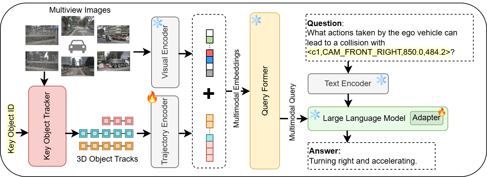
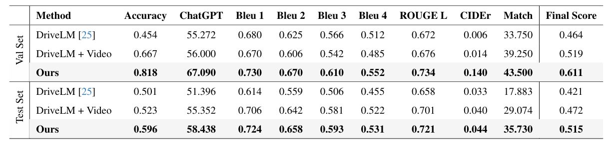
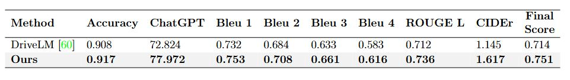

# 🚗💡 **Tracking Meets Large Multimodal Models for Driving Scenario Understanding**

📌 **Enhancing autonomous driving with tracking-powered multimodal understanding!**

---

## ✨ **Overview**
This repository presents an innovative approach that integrates **3D object tracking** into **Large Multimodal Models (LMMs)** to enhance **spatiotemporal understanding** in autonomous driving. 🚘⚡ By leveraging tracking information, we significantly improve **perception, planning, and prediction** compared to baseline models.


🔹 **Key Benefits:**
- **📸 Vision + Tracking:** We enhance VQA in autonomous driving by integrating tracking-based embeddings.
- **🚀 3D Object Tracking:** We use **3DMOTFormer** for robust multi-object tracking, improving contextual understanding.
- **🔗 Multimodal Fusion:** Images and tracking features are **jointly processed** to enhance reasoning and predictions.
- **🧠 Self-Supervised Pretraining:** Our tracking encoder boosts model comprehension.
- **🏆 Benchmark Success:** We achieve a **9.5% accuracy gain** and **7.04-point ChatGPT score improvement** on **DriveLM-nuScenes**, and a **3.7% final score increase** on **DriveLM-CARLA**. 📊🔥


---

## 📂 **Data Preparation**

🔹 **VQA Datasets:** Obtain datasets following instructions from **[DriveLM](https://github.com/OpenDriveLab/DriveLM/blob/main/challenge/README.md)**.

🔹 **Tracking Data:**
- **📌 Step 1:** Generate 3D object and ego-vehicle tracks using **[3DMOTFormer](https://github.com/your-link-to-3dmotformer)**.
- **📌 Step 2:** Process these tracks to map key object and ego-vehicle trajectories for each question.

---

## 🏆 **Results**

### 🚘 **DriveLM-nuScenes**


### 🌍 **DriveLM-CARLA**


---

## ⚙️ **Setup & Fine-Tuning**

💡 **To set up and fine-tune the model,** refer to `[llama_adapter_v2_multimodal7b/README.md]` in this repository.

---

## 🚀 **Inference**

🔧 **Before running inference, extract the adapter weights using `save_weights.py`.** Inside this script, set the trained weights path and output path accordingly.

Run the following command to perform inference on test data:

```bash
cd  llama_adapter_v2_multimodal7b/
python demo.py --llama_dir /path/to/llama_model_weights \
               --checkpoint /path/to/pre-trained/checkpoint.pth \
               --data ../test_llama.json  \
               --output ../output.json \
               --batch_size 4 \
               --num_processes 8
```

---

## 📊 **Evaluation**

🔍 **To evaluate the model's performance:**

1️⃣ **Set up the evaluation package** using instructions in **[DriveLM Challenge ReadMe](https://github.com/OpenDriveLab/DriveLM/blob/main/challenge/README.md)**.

2️⃣ **Run the evaluation script:**

```bash
python evaluation/evaluation.py --root_path1 ./output.json --root_path2 ./test_eval.json
```

---
## 🚀 TODO List

- [ ] 📢 Release pretrained weights  
- [ ] 🎯 Release finetuned checkpoint
- [ ] 📊 Release nuScenes train and test VQA with tracks  
---

## 🙏 **Acknowledgments**
We sincerely appreciate the contributions and resources from the following projects:

- 🚗 **[DriveLM](https://github.com/OpenDriveLab/DriveLM)** – Benchmark datasets & evaluation.
- 🦙 **[LLaMA Adapter](https://github.com/ZrrSkywalker/LLaMA-Adapter)** – Large Multimodal Model foundation.
- 🎯 **[3DMOTFormer](https://github.com/your-link-to-3dmotformer)** – 3D multi-object tracking.
- 🌍 **[nuScenes Dataset](https://www.nuscenes.org/)** – Real-world autonomous driving dataset.

---

🚀 **If you like this project, drop a ⭐ on GitHub!** 💙

